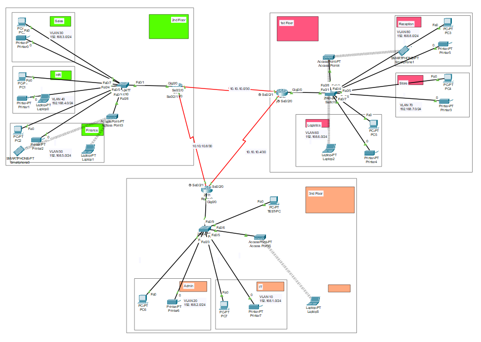
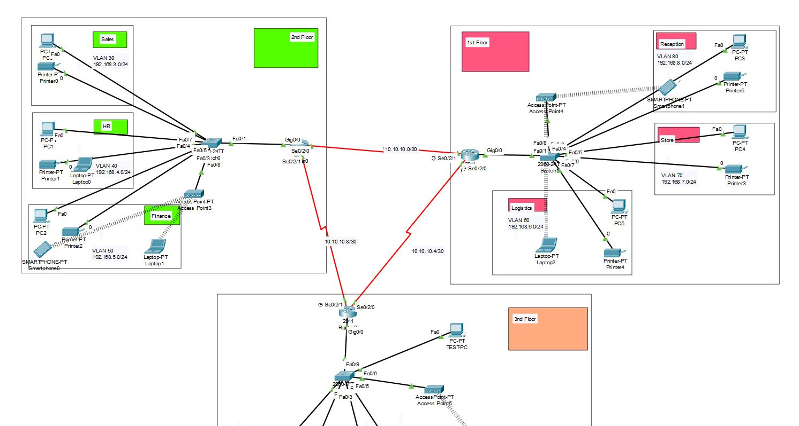
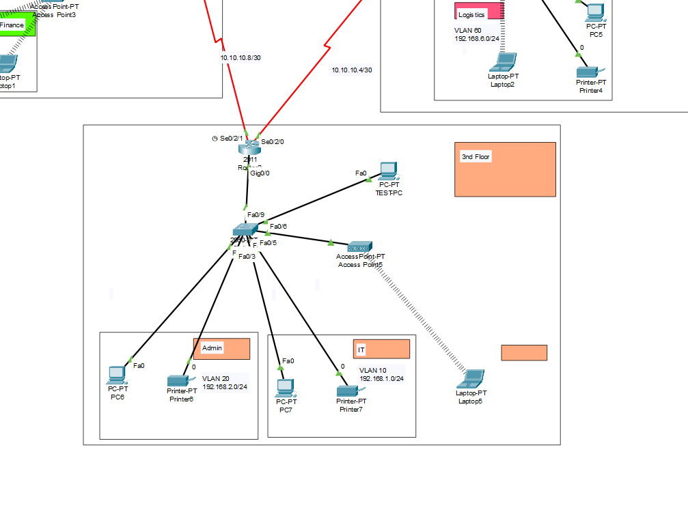

# 🏢 Cisco Lab — Mạng Doanh Nghiệp Đa Chi Nhánh

## Giới Thiệu

Bài lab mô phỏng hệ thống mạng của một công ty có **ba chi nhánh văn phòng đặt tại ba địa điểm khác nhau**, kết nối với nhau qua đường truyền WAN (Serial link). Mỗi chi nhánh được tổ chức thành nhiều tầng và phòng ban riêng biệt thông qua VLAN, trong khi các router đảm nhiệm việc định tuyến để toàn bộ nhân viên — dù ở chi nhánh nào — đều có thể giao tiếp với nhau.

---

## 🗺️ Mô Hình Topology

### Tổng Quan

### Chi Tiết

### Chi Nhánh 3 (3rd Floor)

---

## 🌐 Kết Nối Giữa Các Chi Nhánh (WAN)

Ba chi nhánh được kết nối với nhau qua **Serial WAN** theo mô hình hub-and-spoke / mesh:

| Đường Truyền | Subnet | Hai Đầu |
|---|---|---|
| Branch 1 ↔ Branch 2 | 10.10.10.0/30 | Se0/2/0 — Se0/2/1 |
| Branch 1 ↔ Branch 3 | 10.10.10.8/30 | Se0/2/1 — Se0/2/1 |
| Branch 2 ↔ Branch 3 | 10.10.10.4/30 | Se0/2/0 — Se0/2/0 |

---

## 🏬 Chi Nhánh 1 — 2nd Floor

| VLAN | Phòng Ban | Subnet |
|---|---|---|
| VLAN 30 | Sales | 192.168.3.0/24 |
| VLAN 40 | HR | 192.168.4.0/24 |
| VLAN 50 | Finance | 192.168.5.0/24 |

> Có Access Point phục vụ kết nối WiFi cho thiết bị di động (Smartphone, Laptop không dây).

---

## 🏬 Chi Nhánh 2 — 1st Floor

| VLAN | Phòng Ban | Subnet |
|---|---|---|
| VLAN 60 | Logistics | 192.168.6.0/24 |
| VLAN 70 | Store | 192.168.7.0/24 |
| VLAN 80 | Reception | 192.168.8.0/24 |

> Có Access Point phục vụ kết nối WiFi. Smartphone1 kết nối không dây vào khu vực Reception.

---

## 🏬 Chi Nhánh 3 — 3rd Floor

| VLAN | Phòng Ban | Subnet |
|---|---|---|
| VLAN 10 | IT | 192.168.1.0/24 |
| VLAN 20 | Admin | 192.168.2.0/24 |

> Có Access Point (Access Point5) và TEST-PC phục vụ kiểm tra kết nối mạng nội bộ và liên chi nhánh.

---

## ✅ Những Gì Đã Thực Hiện Được

- ✅ **Phân vùng VLAN** cho từng phòng ban tại mỗi chi nhánh, đảm bảo tách biệt lưu lượng nội bộ
- ✅ **Inter-VLAN Routing** (Router-on-a-Stick) cho phép các phòng ban trong cùng chi nhánh giao tiếp với nhau
- ✅ **Kết nối WAN Serial** giữa ba chi nhánh qua các subnet `/30` point-to-point
- ✅ **Static Routing** định tuyến lưu lượng qua lại giữa các chi nhánh, đảm bảo nhân viên ở bất kỳ văn phòng nào cũng kết nối được với nhau
- ✅ **Wireless Access Point** triển khai tại các chi nhánh, hỗ trợ Smartphone và Laptop kết nối WiFi
- ✅ **Kiểm tra kết nối** thành công từ TEST-PC tại chi nhánh 3 tới các thiết bị ở chi nhánh 1 và 2

---

## 🛠️ Công Cụ

- **Cisco Packet Tracer**
