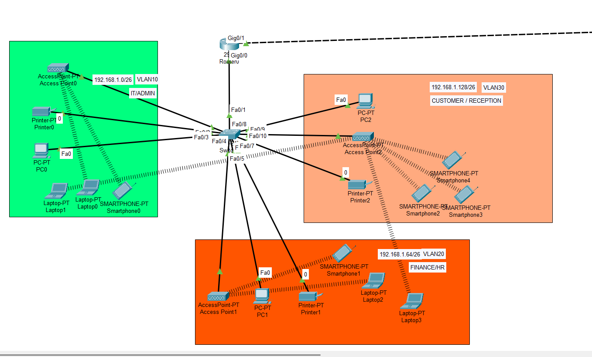
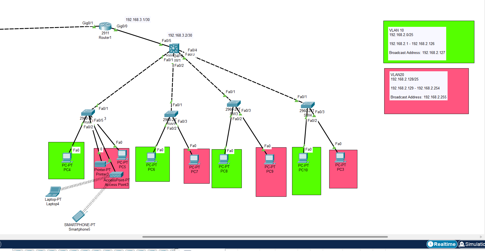

# 🏢 Cisco Lab — Mạng Nội Bộ Doanh Nghiệp Hai Chi Nhánh

## Giới Thiệu

Bài lab mô phỏng hệ thống mạng của một công ty có **hai văn phòng đặt tại hai địa điểm khác nhau**, được kết nối với nhau qua đường truyền WAN. Mục tiêu là đảm bảo các phòng ban trong công ty — dù đang ở văn phòng nào — đều có thể giao tiếp thông suốt với nhau.

Mạng nội bộ mỗi văn phòng được chia thành các **VLAN riêng biệt** theo phòng ban, giúp tách biệt lưu lượng và tăng cường bảo mật. Kết nối liên chi nhánh được thực hiện qua **router với static route**, cho phép nhân viên tại hai văn phòng trao đổi dữ liệu như thể đang trong cùng một mạng.

---

## 🗂️ Phân Vùng Mạng

### Văn Phòng 1

| VLAN | Phòng Ban | Subnet |
|---|---|---|
| VLAN 10 | IT / Admin | 192.168.1.0/26 |
| VLAN 20 | Finance / HR | 192.168.1.64/26 |
| VLAN 30 | Customer / Reception | 192.168.1.128/26 |

### Văn Phòng 2

| VLAN | Phòng Ban | Subnet |
|---|---|---|
| VLAN 10 | Staff (nhóm A) | 192.168.2.0/25 |
| VLAN 20 | Staff (nhóm B) | 192.168.2.128/25 |

### Kết Nối WAN
- **Subnet:** `192.168.3.0/30` (point-to-point giữa hai router)

---

## 🖼️ Mô Hình Topology

### Văn Phòng 1

### Văn Phòng 2

---

## 🛠️ Công Cụ

- **Cisco Packet Tracer**
